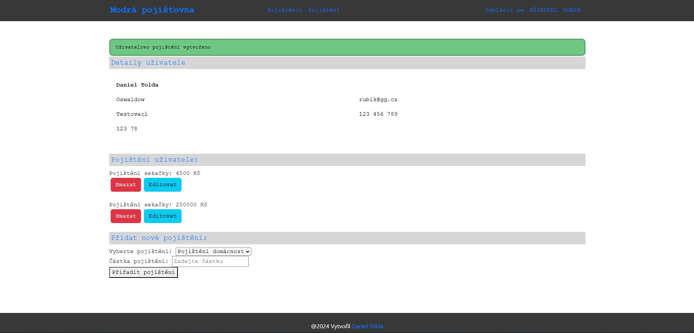
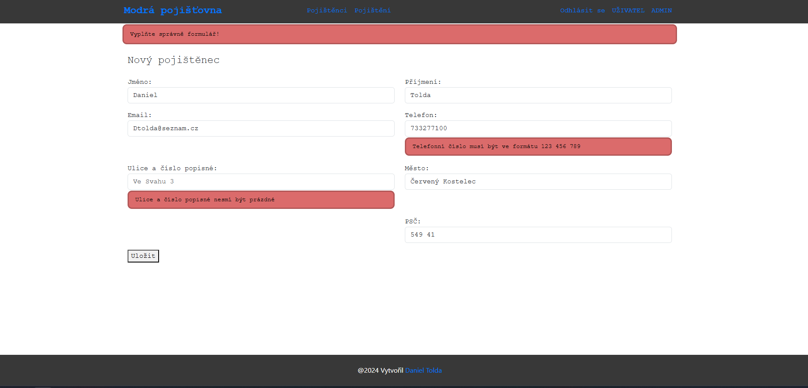

# Evidence pojištění  

Tento projekt vznikl jako součást kurzu pro **ITnetwork**, kde jsem si zvolil náročnější variantu zadání.  
Projekt je napsán v programovacím jazyce **Java** a zaměřuje se na správu evidence pojištění.  

## Použité technologie a přístupy  
- **Spring Boot**: Framework pro rychlý vývoj webových aplikací.  
- **DTO (Data Transfer Object)**, **entity** a **mapper**: Architektura zaměřená na oddělení datových modelů od prezentační vrstvy a zajištění přehledného a udržitelného kódu.  
- **Secure**: Implementace autentizace a autorizace uživatelů.  
- **Lombok**: Knihovna usnadňující práci s modely díky generování getterů, setterů a dalších standardních metod.  
- **Thymeleaf**: Šablonovací engine pro tvorbu uživatelského rozhraní.  
- **Databáze**: Aplikace je propojena s relační databází (např. MySQL) a umožňuje registraci uživatelů i správu dat pojištěnců a jejich pojištění.  

## Hlavní funkce  
1. **Registrace a správa uživatelů**: Uživatelé se mohou registrovat a přihlašovat pomocí zabezpečeného systému.  
2. **CRUD operace**: Plná podpora vytváření, čtení, aktualizace a mazání záznamů o pojištěncích a jejich pojištěních.  
3. **Responzivní design**: Uživatelské rozhraní je optimalizované pro různá zařízení.  
4. **Datová validace**: Kontrola a zpracování vstupů na straně klienta i serveru.  

## Cíle projektu  
- Naučit se pokročilé technologie a postupy v rámci vývoje moderních webových aplikací.  
- Dodržovat osvědčené softwarové principy, jako je oddělení zodpovědností a čistý kód.  
- Připravit projekt, který odpovídá požadavkům reálných podnikových aplikací. 

### Ukázka

  
  

